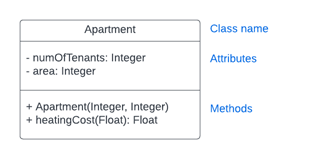

# Assignment 2 - Object-oriented Java

In this repository, you will find a series of exercises designed to help you practice the Java object-oriented programming basics. Each exercise is called a Quest and has a corresponding test class to help you verify your solution.

Key points in the exercises:

- Learn how to create classes with data and methods for different purposes and how to use them in your programs.

- Once you have learned how to create classes, focus on the inheritance as a basic principle of OO.

- Learn to use the keyword `extends` to inherit a class

- In constructor initialization, particularly pay attention to how subclass constructors should call the superclass constructor to ensure proper initialization.

## Quest 1 Apartment (1 point)

Create a class called `Apartment` based on the following UML class diagram:

- Pay attention to the access modifiers for each member variable or method

- As you see, contructor with two parameters is needed: the number of tenants as the 1st parameter and the area of the apartment as the 2nd parameter.

- Add method `heatingCost` which takes the electricity price kw/h as parameter of type Float. Method calculates the heating as `numOfTenants * area * price` and returns it.

## Quest 2 Vehicle (1 point)

Create Java class `Vehicle`, that has

- Private member variable `fuelUsed` that is type Double. This stores how much fuel the vehicle has used.

- Private member variable `distanceDriven` that is type Double that stores how many kilometers the vehicle has driven.

- Constructor with parameter that initializes the member variable `distanceDriven`

- Getters and setters for the variables `fuelUsed` and `distanceDriven`

- Public method `getFuelConsumption` that returns the fuel consumption as liters per 100km (`fuelUsed / distanceDriven * 100`) with return type Double

## Quest 3 Truck (1 point)

Create class `Truck` that inherits the class `Vehicle`

- Remember to add keyword `extends` in the class declaration. Its not there by default.

- Constructor has 4 parameters: String `name`, String `model`, Integer `year` and Double `distanceDriven`. 

- In the constructor, you need to call the superclass constructor with the `distanceDriven` parameter!

- For the `Truck` class create method `getDetails` that return the truck details as String consisting of member variables `name model year`

The key idea here is to use the existing data and methods of the parent class `Vehicle`. The idea is **not to rewrite** those into the child class. This would break the whole idea of inheritance in OOP..

## Quest 4 Shapes (2 points)

In this exercise you need to create three classes. First create base class `Shape` and then classes `Rectangle` and `Circle`, which both inherit `Shape`.

Again, remember to use the keyword `extends` in the class declarations. Otherwise inheritance won't work.

The `Shape` class has

- Protected attribute String `name`

- Constructor with parameter String `name`, which initializes the member variable

- Method Double `getArea` that returns the shape area. This should by default return the value `0.0`

- Overridden method String `toString` from the Object class, that returns the member variable `name`

The subclass `Rectangle` class inherits all of the above from `Shape` and additionally has

- Private attributes `width` and `height`, both of type Double

- Constructor is needed to initialize values into `name`, `width` and `height`. Remember to call superclass constructor here!

- Overridden method Double `getArea` that returns the area as `width * height`

The subclass `Circle` similarly inherits the `Shape` class and additionally has

- Private attribute `radius`, type is Double

- Constructor needed to set `name` and `radius`. Remember to call superclass constructor here!

- Overridden method Double `getArea` that returns the area as `pi*radius*radius`

Again, The key idea here is to use the existing data and methods of the parent class and **not to rewrite** these into the child classes. 
